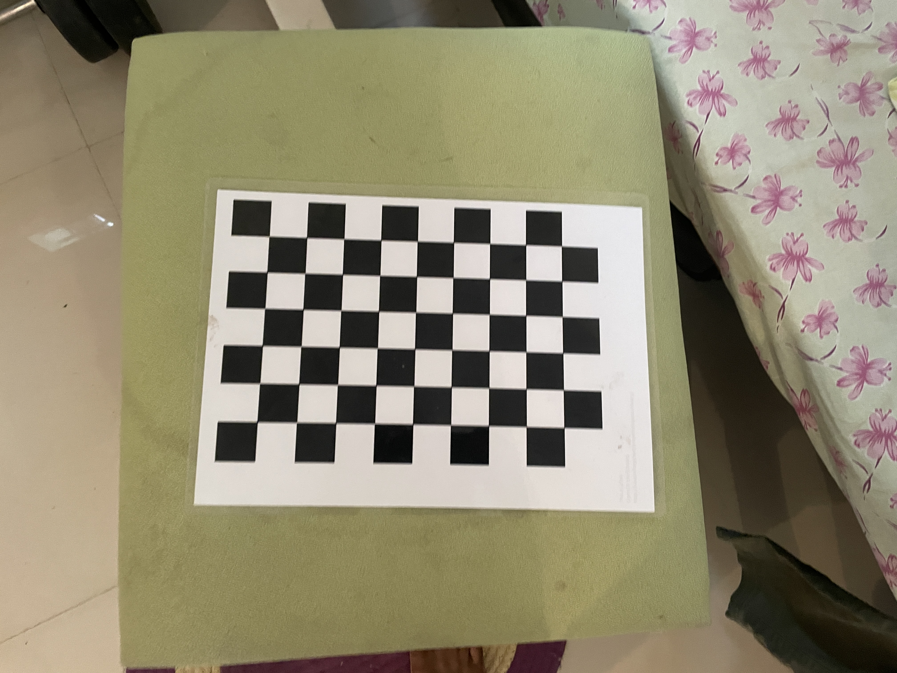
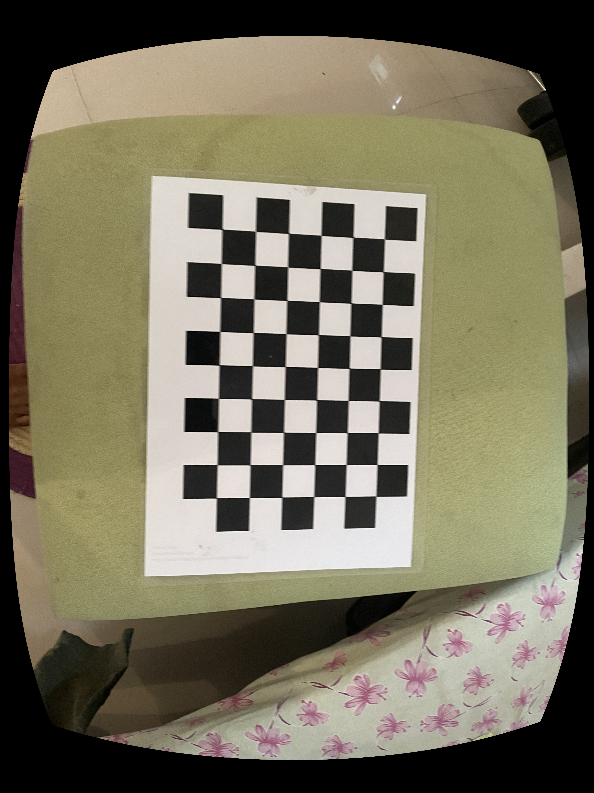
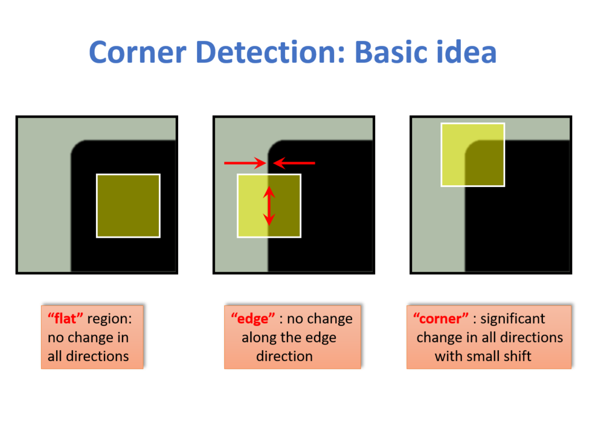

# Harris corner detection .


How to do?
First capture a few images by rotating your mobile camera, such that there exist some scene
overlapping.

Manual Method [20] marks
1. Apply Harris cornor or SIFT to extract feature points
2. Manually select some feature points on each image.
3. Find the homography matrix that align each pair of neighbor pictures.
4. Transform the source image so as to be in the same projective space as the target image.
5. Stitch images by taking the target image and placing it in the location given by the
multiplication inverse of the homography matrix.

Automatic Method [10 marks]
1. Apply Harris cornor or SIFT to extract feature points
2. Match feature points to find their correspondences.
3. Find the homography matrix that align each pair of neighbor pictures.
4. Transform the source image so as to be in the same projective space as the target image.
5. Stitch images by taking the target image and placing it in the location given by the
multiplication inverse of the homography matrix.

Q2. Depth Estimation
a. Take two images in epipolar view of your previous assignment. Rectifiy the images
using cv.stereoRectifyUncalibrated lib function . Show slanted epipolar line ans parallel
epipolar lines .
b. Estimate depth maps of the two images
c. Use multiple images of a scene to set a complete 3d depth models


## Calibrate the camera in use using a checkerboard .

I have a printed checkerboard of 10x7 of 2cm size for each box .


```
python3 calibrate.py
```

After calibration i got 

```
RET= 1.3102230553328593

MTX= [[2.88868277e+03 0.00000000e+00 1.46732299e+03]
 [0.00000000e+00 2.89333800e+03 2.02451966e+03]
 [0.00000000e+00 0.00000000e+00 1.00000000e+00]]

DIST= [[ 1.58630260e-01 -1.08880580e+00 -1.76805105e-03 -8.12556620e-03
   3.15235533e+00]]   
```

Original Test image 




After Undistorting  image 




## Harris corner detection 




