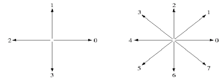
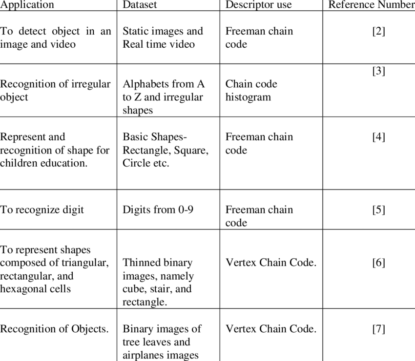
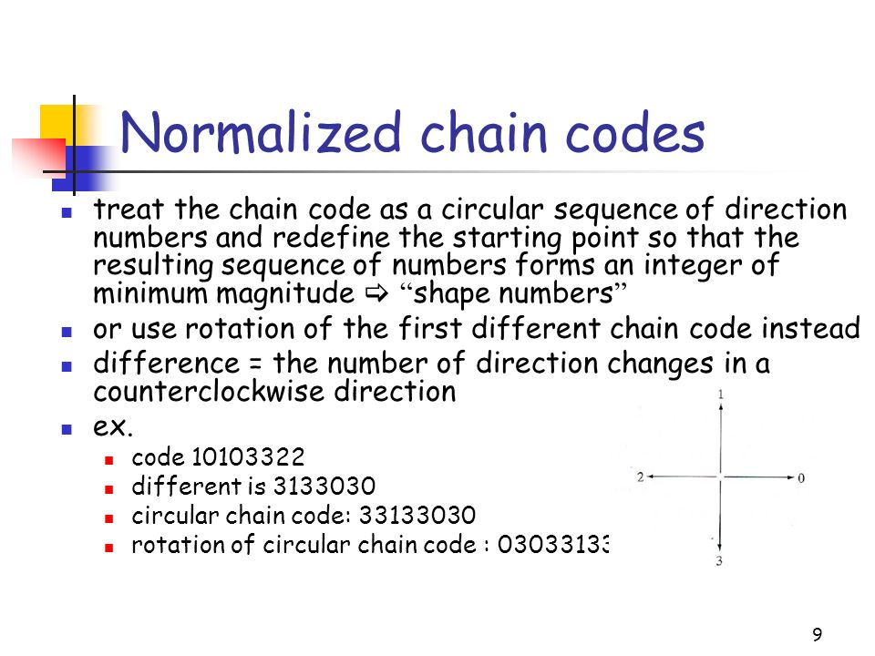
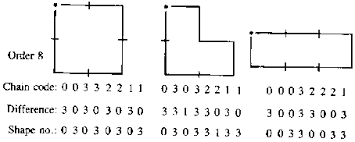

Chain Codes ()

https://ojskrede.github.io/inf4300/notes/week_04/

- convert set of points into numerical value 
- Change the starting point , what will my chain code look like . 

Why are we normalizing the chain code ?

- to make it generic 
- changing the starting point will change the 
- to get the same chain code , irrespective of the starting point 

Rotation Invarient chain codes 

    -  Find the difference in the code (in angles that are integer multiples of the directions by using the firest difference of the chain code )
    - First Difference of chain code :
    This difference is obstained by counding the number of direction changes in counterclockwise direction that separate two adjacent elements of the code .
    - 

What happens , when we change the starting point ?

-  Invaraince to rotation 
- 

- normalized chain code

    - circular chain code 
        Form integer of  Minimum magnitude Maximum magnitude 

### Chain Codes - Invariant to translation 

- use circular shift only
- 

### Application of freemain chain code 

-  Classification of microbes 
-  In the context of microbes 
    - capture image
    - threshold image 
    - scalar boundary 
    - overlap it with grid size 
    - shape that we get 
    - rotated 

- Final objective 

    - Irrespective of starting point and ending point , we should get the same shape and 

     
# Shape numbers

- Four connectivity 

    - example of shape nos 
    - Features
    - D- Dimensional F Vector 
    - Feature space 
    - Shape feature using chain codes 
        - how to make chain codes independent of starting point 
            - only circular shapes is allowed and normalize it 
            - FD (first difference ) , rotate the first d
            - Unique chain code for the particular object 
    - Order of the shape no

-----------------------------------------------------------------------------
==========   28th May 2023 =====================